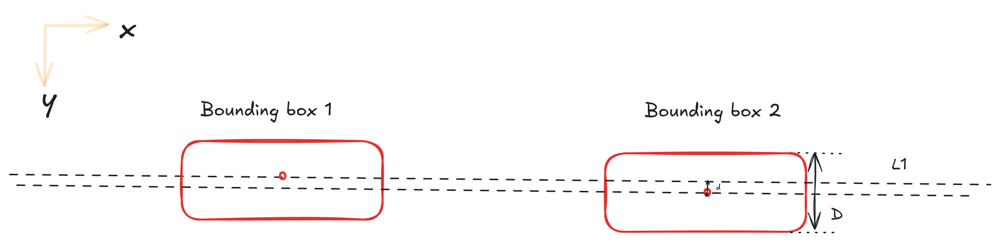

# bbox-align (In development)

`bbox-align` is a Python library that reorders bounding boxes generated by OCR engines into the correct reading order. It aims to group bounding boxes into logical lines (even when documents have folds, irregular spacing, or distortions) and sort them for downstream use in document processing.

## Installation

`pip install bbox-align`

**Prereqs:** Python 3.8+

## Concept
Two bounding boxes are considered inline if the y-coordinate of one box's vertical center lies within the top and bottom bounds of the other box.

